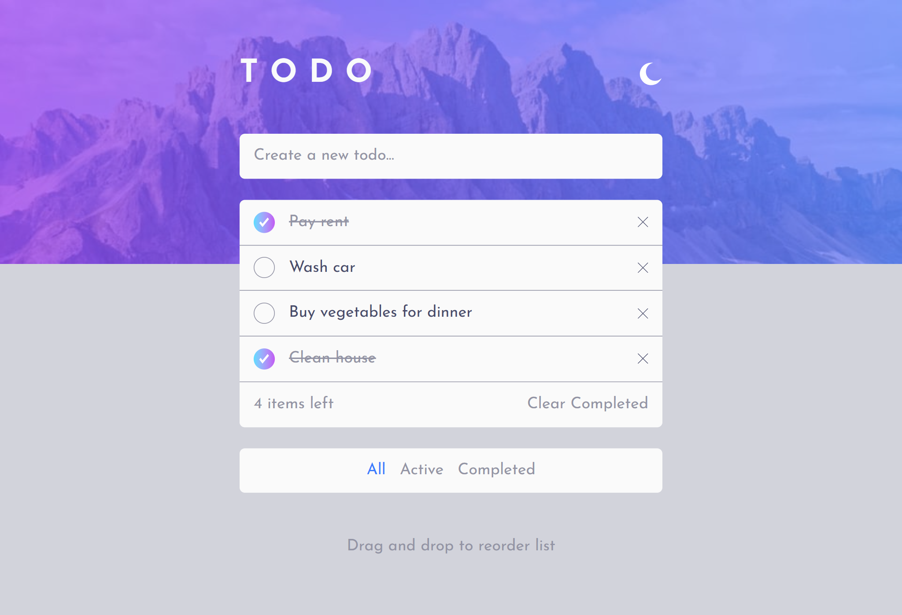

# Todo app

This is a fullstack Todo application built with Next.js, Prisma and  Vercel.
It allows users to create, delete and filter todos with persistent database storage and simple “fake auth” using a browser-based userId.

## Live Site

[View Live Site](https://frontendmentor-todo-app-seven.vercel.app/)

## Features

- Create new todos
- Mark todos as completed / active
- Delete individual todos
- Clear all completed todos
- Filter todos (All / Active / Completed)
- Storage with Prisma database
- Fake authentication using localStorage userId
- Deployed on Vercel

## Technologies

- Next.js
- React
- JavaScript (ES6+)
- Tailwind CSS
- Prisma
- Vercel

## Getting Started

1. Clone the repository: git clone URL
2. Navigate to the project folder: cd todo-app
3. Install dependencies: npm install
4. Setup database: npx prisma migrate dev
5. Run the development server: npm run dev
6. Open http://localhost:3000 in your browser